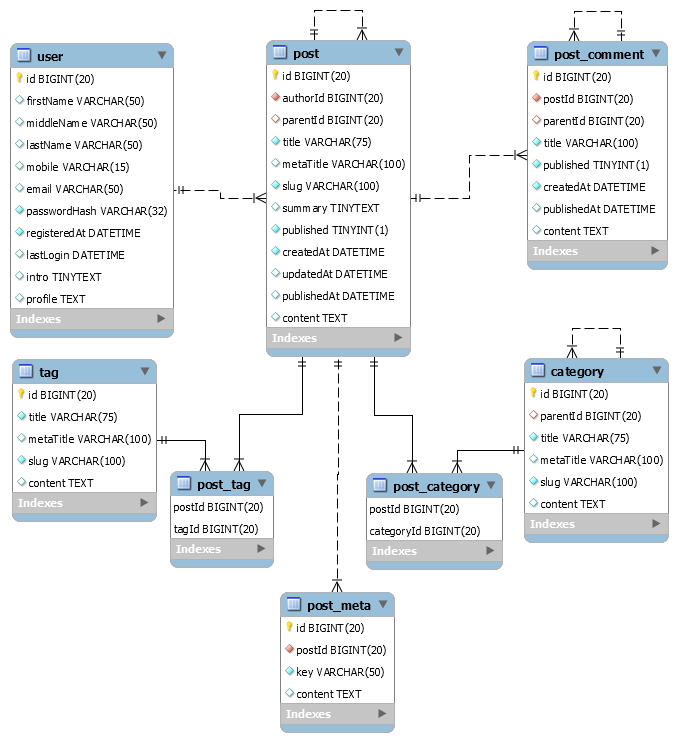

# iu-blog
Open-source blog.

This repository contains api-server and client for blog web-service.

## Tech stack:
Back-end:
- Golang
- Postgresql

Front-end:
- React
- Redux

## Supported functionality
- Posts list page
    - Search
    - Compilation
    - Sort
    - Filter
- Post page
    - Content
    - Comments
    - Publish comment *- Authorized only*
- New post page *- Authorized only*
- Edit post page *- Auhtorized only*
    - Publish
- Delete post *- Authorized only*
- Log-in page
- Sign-up page

## Database schema

## Author
Konstantin Golik
