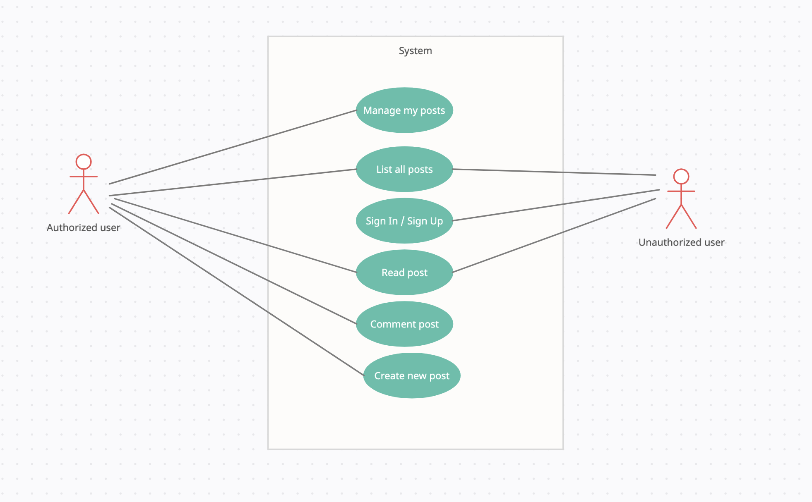
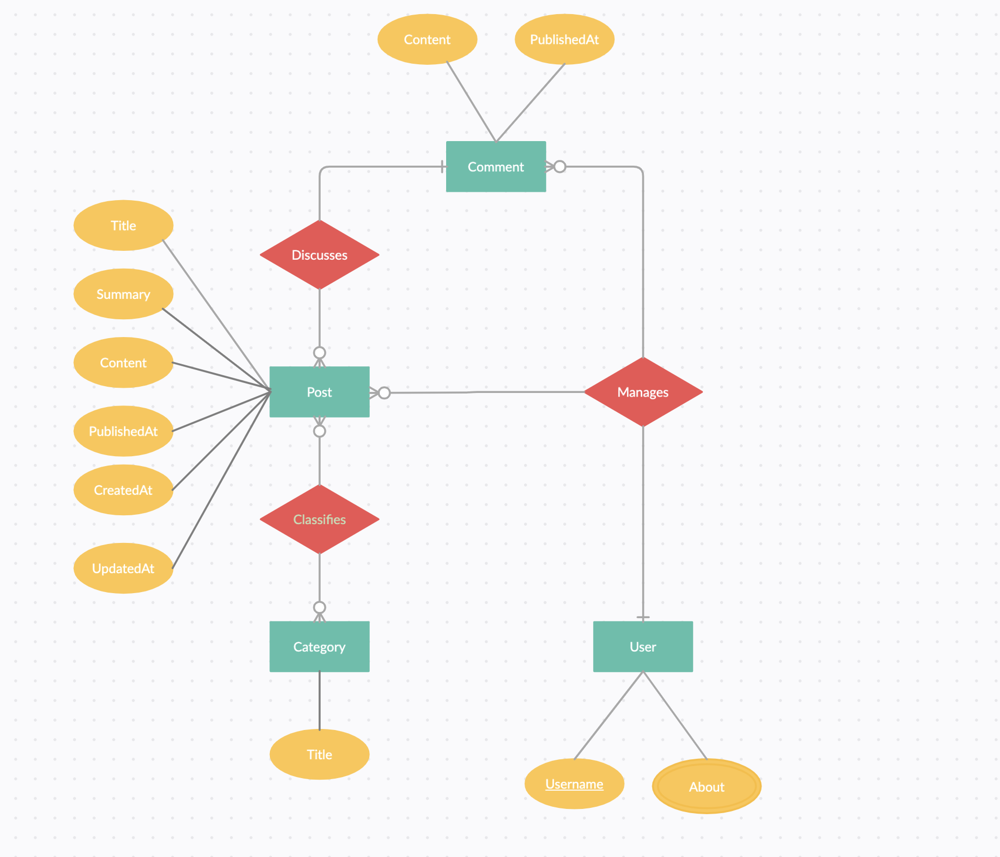

# iu-blog
Open-source blog.

This repository contains api-server and client for blog web-service.

## Tech stack:
Back-end:
- Golang
- Postgresql

Front-end:
- React
- Redux

## Supported functionality
- Posts list page
    - Search
    - Compilation
    - Sort
    - Filter
- Post page
    - Content
    - Comments
    - Publish comment *- Authorized only*
- New post page *- Authorized only*
- Edit post page *- Auhtorized only*
    - Publish
- Delete post *- Authorized only*
- Log-in page
- Sign-up page

## Apache Benchmarking
**/categories**
```
krgolik@MSK-C02C9AFDMD6R ~ % sudo ab -n 100 -c 10 -T application/json  http://127.0.0.1:8080/api/1/categories

==>

This is ApacheBench, Version 2.3 <$Revision: 1843412 $>
Copyright 1996 Adam Twiss, Zeus Technology Ltd, http://www.zeustech.net/
Licensed to The Apache Software Foundation, http://www.apache.org/

Benchmarking 127.0.0.1 (be patient).....done


Server Software:        nginx/1.19.5
Server Hostname:        127.0.0.1
Server Port:            8080

Document Path:          /api/1/categories
Document Length:        136 bytes

Concurrency Level:      10
Time taken for tests:   0.023 seconds
Complete requests:      100
Failed requests:        0
Total transferred:      29500 bytes
HTML transferred:       13600 bytes
Requests per second:    4414.23 [#/sec] (mean)
Time per request:       2.265 [ms] (mean)
Time per request:       0.227 [ms] (mean, across all concurrent requests)
Transfer rate:          1271.68 [Kbytes/sec] received

Connection Times (ms)
              min  mean[+/-sd] median   max
Connect:        0    0   0.1      0       0
Processing:     1    2   1.8      1      10
Waiting:        1    2   1.8      1      10
Total:          1    2   1.8      1      11

Percentage of the requests served within a certain time (ms)
  50%      1
  66%      1
  75%      1
  80%      2
  90%      2
  95%      7
  98%     10
  99%     11
 100%     11 (longest request)
```
**/posts/10**
```
krgolik@MSK-C02C9AFDMD6R ~ % sudo ab -n 100 -c 10 -T application/json  http://127.0.0.1:8080/api/1/posts/10

==>

Benchmarking 127.0.0.1 (be patient).....done


Server Software:        nginx/1.19.5
Server Hostname:        127.0.0.1
Server Port:            8080

Document Path:          /api/1/posts/10
Document Length:        252 bytes

Concurrency Level:      10
Time taken for tests:   0.036 seconds
Complete requests:      100
Failed requests:        0
Total transferred:      41100 bytes
HTML transferred:       25200 bytes
Requests per second:    2796.26 [#/sec] (mean)
Time per request:       3.576 [ms] (mean)
Time per request:       0.358 [ms] (mean, across all concurrent requests)
Transfer rate:          1122.33 [Kbytes/sec] received

Connection Times (ms)
              min  mean[+/-sd] median   max
Connect:        0    0   0.1      0       0
Processing:     1    3   2.9      2      16
Waiting:        1    3   2.9      2      16
Total:          1    3   2.9      2      16

Percentage of the requests served within a certain time (ms)
  50%      2
  66%      2
  75%      2
  80%      2
  90%      8
  95%     10
  98%     16
  99%     16
 100%     16 (longest request)
```

## Use-case schema



## Database schema


## Author
Konstantin Golik
